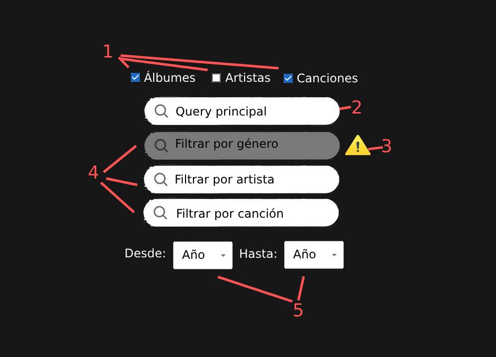
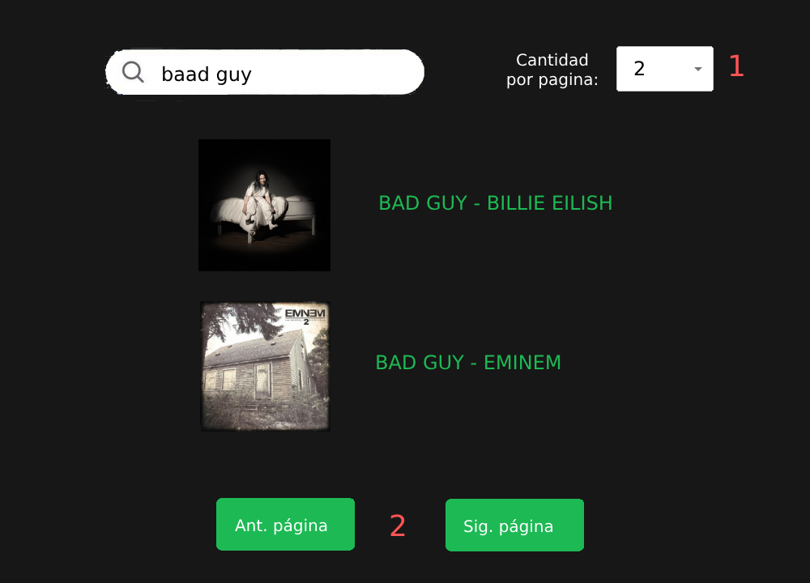
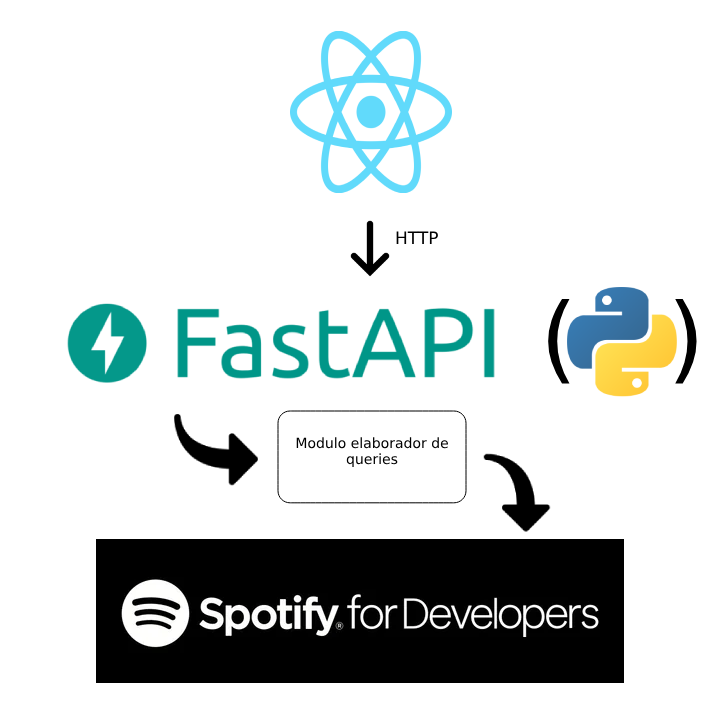

# Webir Spotify Lookup

Aplicacion para realizar lookups con la API de Spotify.

## Diseño

### Frontend



1. Selector de tipos, se indica que tipo de resultados se busca. Si no se selecciona por lo menos 1 el buscador no se habilita
2. Buscador principal para ingresar su query
3. Indicador de filtro no disponible. Tooltip que indica por que este input se desactivo
4. Filtros disponibles
5. Filtro por rango de años



1. Indicador de limite de resultados
2. Paginación de resultados

### Backend



## Setup

### Spotify

Se usa la libreria [Spotipy](https://spotipy.readthedocs.io/en/2.22.1/) para consumir la API de Spotify. Desde spotify se creó una aplicacion en el [dashboard de developer](https://developer.spotify.com/dashboard). Estas aplicaciones estan asociadas a una cuenta personal de Spotify, la actualmente utilizada se llama "Webir Spotify Lookup".

Para utilizar el cliente es necesario indicarle al ambiente dos valores `SPOTIPY_CLIENT_ID` y `SPOTIPY_CLIENT_SECRET`. En MacOS y Linux esto se hace usando los siguientes comandos

```
export SPOTIPY_CLIENT_ID=<valor>
export SPOTIPY_CLIENT_SECRET=<valor>
```

Para usar "Webir Spotify Lookup" los valores estan en `backend/src/clients/spotify_client.py``

### Backend

Python [FastAPI](https://fastapi.tiangolo.com/)

Para instalar FastAPI

```
pip3 install fastapi uvicorn
```

Para levantar el backend

```
cd backend/src
uvicorn main:app --reload
```

### Frontend

Javascript React. Creado con [Create React App](https://facebook.github.io/create-react-app)

Para levantar el frontend

```
npm i
npm start
```
